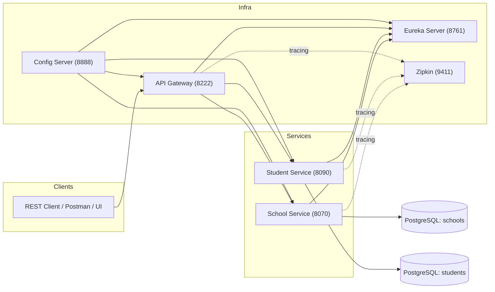

# Microservices-Based School Management System

## **Overview**

A microservices system for managing **schools** and **students**. It uses **Spring Boot 3.0.5** with **Spring Cloud 2022.0.2** (Config Server, Eureka, Gateway), **PostgreSQL**, and **Zipkin** for distributed tracing. Services are container-friendly (Docker) and fetch configuration from a **native-mode Config Server**.

---

## **Architecture**



**Service names (`spring.application.name`)**

* `config-server`, `discovery`, `gateway`, `schools`, `students`

**Config import (in each service)**
`spring.config.import: optional:configserver:http://localhost:8888`

---

## **Tech Stack**

* **Java 17**, **Spring Boot 3.0.5**
* **Spring Cloud 2022.0.2**: Config Server, Eureka, Gateway
* **Data**: PostgreSQL (JPA/Hibernate)
* **Tracing**: Micrometer Tracing (Brave) + Zipkin
* **HTTP**: REST (School composes data by calling Student via Gateway)
* **Build**: Maven
* **Docker**: docker-compose for Postgres, pgAdmin, Zipkin

---

## **Modules & Key Files**

```
config-server/
  src/main/resources/configurations/
    application.yml        # shared defaults (native, search-locations)
    discovery.yml          # Eureka server properties
    gateway.yml            # Gateway port & routes (→ students, schools)
    schools.yml            # School service: port 8070, datasource, tracing, students-url
    students.yml           # Student service: port 8090, datasource, tracing

discovery/                 # Eureka Server (8761)
gateway/                   # Spring Cloud Gateway (8222)
school/                    # School Service (8070)
  .../SchoolController.java
  .../FullSchoolResponse.java
  .../Student.java
student/                   # Student Service (8090)
  .../StudentController.java
  docker-compose.yml       # starts Postgres, pgAdmin, Zipkin
```

---

## **Runtime Ports**

* **Config Server**: `8888`
* **Eureka (Discovery)**: `8761` → UI at `http://localhost:8761`
* **Gateway**: `8222`
* **School Service**: `8070`
* **Student Service**: `8090`
* **Zipkin**: `9411` → UI at `http://localhost:9411`
* **PostgreSQL**: `5432` (compose)
* **pgAdmin**: `5050` (compose)

---

## **Gateway Routes**  *(from `config-server/.../gateway.yml`)*

```yaml
server:
  port: 8222
spring:
  cloud:
    gateway:
      discovery.locator.enabled: true
      routes:
        - id: students
          uri: http://localhost:8090
          predicates:
            - Path=/api/v1/students/**
        - id: schools
          uri: http://localhost:8070
          predicates:
            - Path=/api/v1/schools/**
eureka.client.register-with-eureka: false
management.tracing.sampling.probability: 1.0
```

---

## **Data Model (JPA)**

* **School**: `id`, `name`, `email`
* **Student**: `id`, `firstname`, `lastname`, `email`, `schoolId`

**Composed response (School → Students)** — `FullSchoolResponse`:

```json
{
  "name": "Greenwood High",
  "email": "contact@greenwood.com",
  "students": [
    { "firstname": "Alice", "lastname": "Smith", "email": "alice@x.com" }
  ]
}
```

---

## **REST API**

### **School Service** (`:8070`)

Controller: `SchoolController.java`

* **Create School**

  ```
  POST /api/v1/schools
  Content-Type: application/json

  { "name": "Greenwood High", "email": "contact@greenwood.com" }
  ```
* **Get All Schools**

  ```
  GET /api/v1/schools
  ```
* **Get School + Students**

  ```
  GET /api/v1/schools/with-students/{schoolId}
  ```

### **Student Service** (`:8090`)

Controller: `StudentController.java`

* **Create Student**

  ```
  POST /api/v1/students
  Content-Type: application/json

  {
    "firstname": "Alice",
    "lastname": "Smith",
    "email": "alice.smith@example.com",
    "schoolId": 1
  }
  ```
* **Get All Students**

  ```
  GET /api/v1/students
  ```
* **Get Students by School**

  ```
  GET /api/v1/students/school/{schoolId}
  ```

> **Through the Gateway** use `http://localhost:8222` with the same paths (e.g., `http://localhost:8222/api/v1/schools/...`).

---

## **Configuration (served by Config Server)**

* **Native mode** at `:8888`, serving files from
  `config-server/src/main/resources/configurations`
* Each service uses
  `spring.config.import=optional:configserver:http://localhost:8888`
* **Eureka for services**:

  ```yaml
  eureka.client.service-url.defaultZone: http://localhost:8761/eureka
  ```
* **School → Student call base** (used by `SchoolService`):

  ```yaml
  application.config.students-url: http://localhost:8222/api/v1/students
  ```

---

## **Run the System**

### **A) With Docker (DB + Zipkin via compose)**

From repo root:

```bash
# 1) Build services
mvn -q -DskipTests clean package

# 2) Start infra containers (Postgres, pgAdmin, Zipkin)
docker compose -f student/docker-compose.yml up -d --build
```

Compose uses:

```yaml
postgres:
  POSTGRES_USER: alibou
  POSTGRES_PASSWORD: alibou
  ports: "5432:5432"
pgadmin: port 5050
zipkin: 9411
```

Update your service datasource creds accordingly (or set DB users to `username/password` to match your current YAML).

### **B) Start services locally (order matters)**

```bash
# 1) Config Server (8888)
cd config-server && mvn spring-boot:run

# 2) Eureka Server (8761)
cd ../discovery && mvn spring-boot:run

# 3) Gateway (8222)
cd ../gateway && mvn spring-boot:run

# 4) Student (8090) – needs Postgres :5432/students
cd ../student && mvn spring-boot:run

# 5) School (8070) – needs Postgres :5432/schools
cd ../school && mvn spring-boot:run
```

**Checkpoints**

* Eureka dashboard: `http://localhost:8761`
* Zipkin: `http://localhost:9411`
* Gateway health: `http://localhost:8222/actuator/health`

---

## **cURL Quickstart**

```bash
# Create school
curl -X POST http://localhost:8222/api/v1/schools \
  -H "Content-Type: application/json" \
  -d '{"name":"Greenwood High","email":"contact@greenwood.com"}'

# Create student
curl -X POST http://localhost:8222/api/v1/students \
  -H "Content-Type: application/json" \
  -d '{"firstname":"Alice","lastname":"Smith","email":"alice.smith@example.com","schoolId":1}'

# Get composed school + students
curl http://localhost:8222/api/v1/schools/with-students/1
```

---

## **Observability**

* Tracing enabled with Micrometer + Zipkin (`management.tracing.sampling.probability=1.0` in YAML).
* Open Zipkin at `http://localhost:9411` and search by service name: `gateway`, `schools`, `students`.

---

## **Build Matrix**

* **Spring Boot**: 3.0.5
* **Spring Cloud**: 2022.0.2
* **DB Driver**: `org.postgresql:postgresql`
* **Tracing**: `micrometer-tracing-bridge-brave`, `zipkin-reporter-brave`

---

## **Notes**

* Gateway routes are explicitly pinned to `http://localhost:8070` and `http://localhost:8090`.
  If you want **name-based routing** via Eureka, change `uri:` to `lb://schools` and `lb://students` and ensure the services register with Eureka.
* Your `docker-compose.yml` currently starts DB + Zipkin (not the Java services). That’s fine; run the Spring apps locally or add them as services to the compose file if you want “one-command” bring-up.
